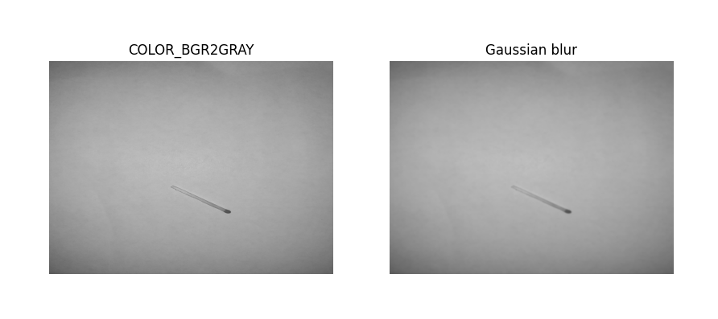
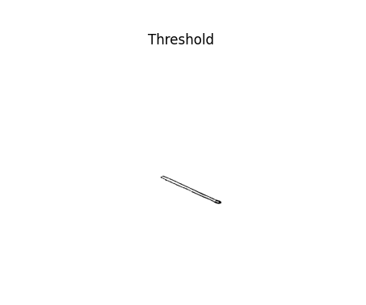
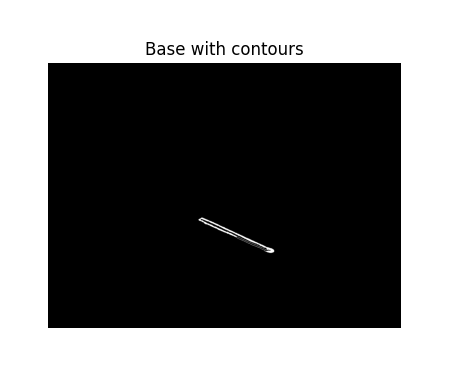
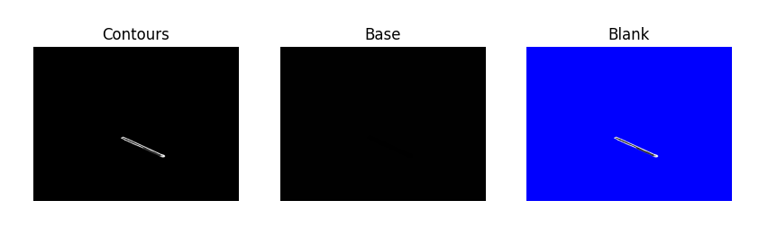
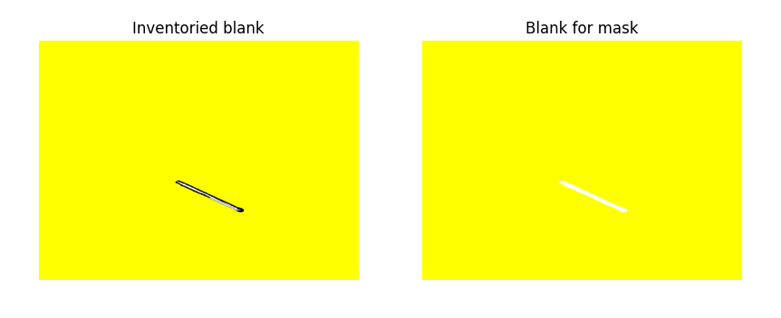
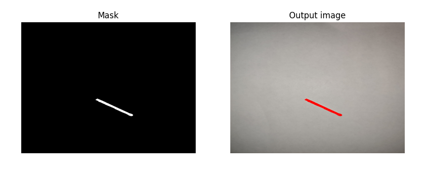
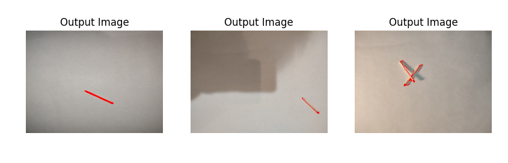
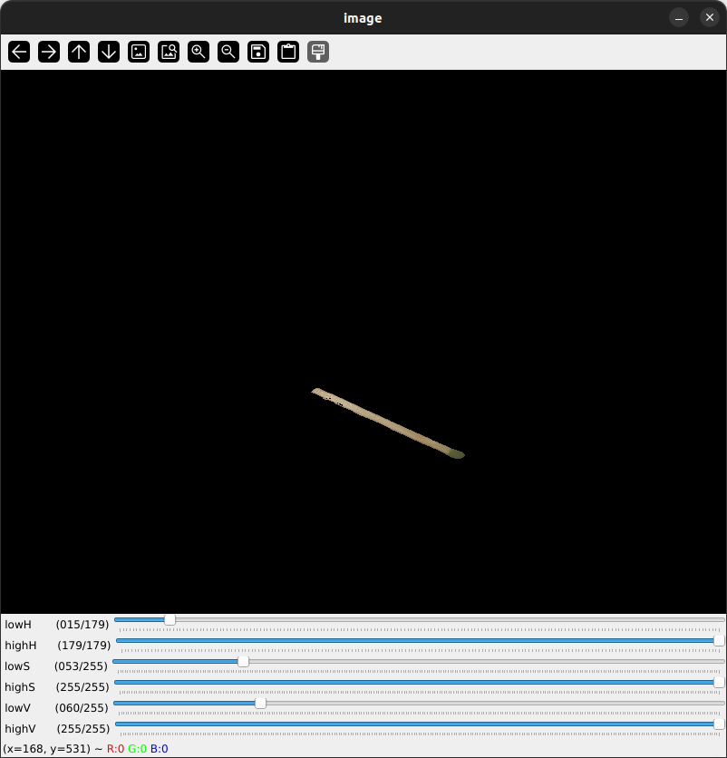
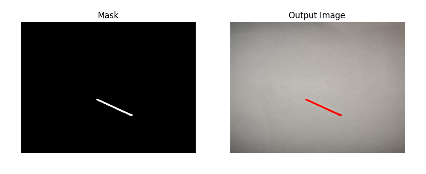
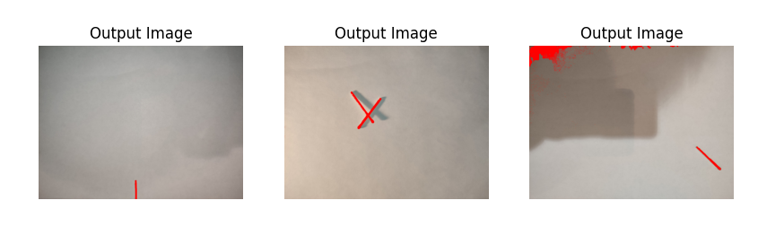

# Найти и закрасить спичку

### Вариант 1 (_first.py_)

Алгоритм:
1. Открываем изображение и меняем его размер, чтобы он помещался на экран (_разрешение использованных фотографий было больше разрешения моего экрана_)

2. Переводим изображение в одноканальный вид и применяем к нему размытие по Гаусу, чтобы сгладить возможные дефекты на бумаге и убрать шумы.

3. Навешиваем трешхолд, разбивая изображение на два цвета и ищем в нём контур.

4. Создаём изображение-болванку, куда перенесём наши контура.

5. Создаём второе изображение-болванку, скопировав содержимое первой. Затем создаём маску и объединяем её с болванкой-2.

6. Инвертируем цвета в болванке номер 2 и объединяем её с первой. Получаем на выходе нужную нам заготовку для маски.

7. Делаем маску по области спички и закрашиваем по ней область на исходном изображении.

Этот способ хорошо подходит для изображений, где есть идеальное освещение и нет прочих теней.

### Вариант 2 (_mask.py_)

Этот способ решения задачи пришёл мне в голову во время работы с маской в предыдущем варианте. 

    Почему бы не сделать маску под спичку просто отделив область листа, а не искать спичку?

1. Для этого переводим картинку из цветовой области BGR в HSV.

2. Теперь нужно подобрать нижнюю и верхнюю границу цветов, чтобы отделить лист. Поскольку вручну с помощью пипетки это делать муторно, было найдено решение в виде интерактивной программки. Где для отделения листа было достаточно установить нижнюю границу._(таким образом не нужно применять трешхолды и единожды подобранные границы цветовой области подходят для весх изображений)_ 

3. Далее согласной цветовым границам создаётся маска и ужо по ней раскрашивается нужная область.

Этот метод подходит как для изображений с тенями от спички, так и с тенями от рук (_время от времени появлятся артефакты из-за близосци по цвету спички и тени от рук_):

